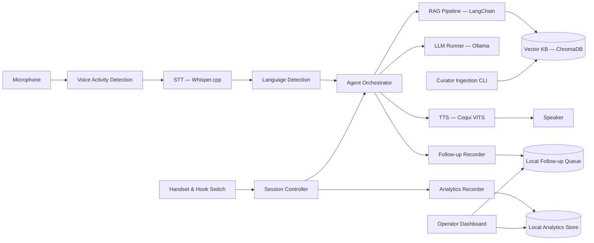
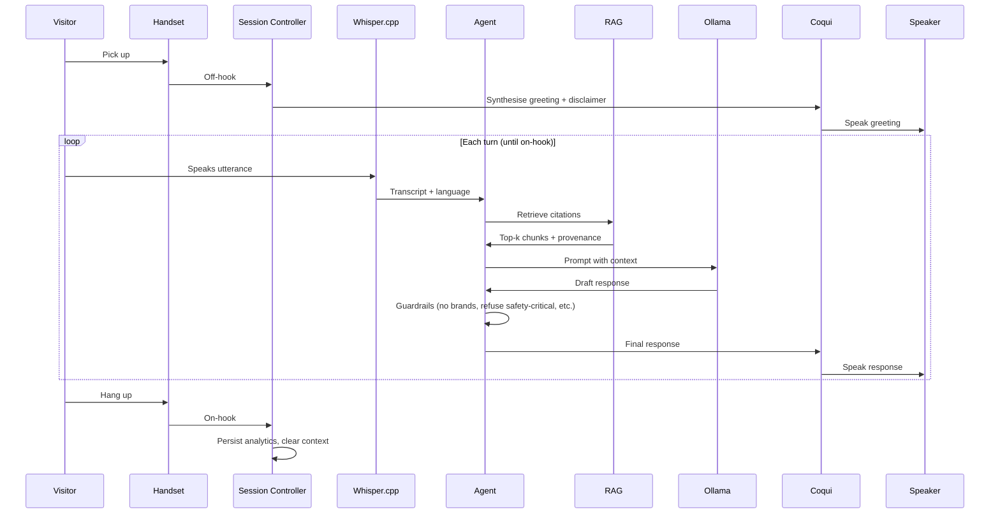

# Joulie — Design

Technical design for the Joulie sovereign, voice-only, offline electrification advisor. This document turns the scope and scenarios into a concrete component architecture, runtime pipeline, deployment topology, and the cross-cutting concerns (sovereignty, privacy, observability) the team needs to build against.

See also: [scope.md](scope.md), [scenarios.md](scenarios.md), [../ai/project-brief.md](../ai/project-brief.md).

---

## 1. Design Principles

1. **Voice-only interaction.** No keyboards, no on-screen menus. Every user action is either picking up the handset, speaking, or hanging up.
2. **Offline and sovereign.** All inference, retrieval, storage, and analytics run on the Mac Mini. No network dependency at runtime.
3. **Grounded, not generative-from-thin-air.** Every factual answer must be backed by a retrieved citation, or Joulie must say it doesn't know.
4. **Stateless per visitor.** Conversation context is held in memory and discarded on hang-up. No personal data is persisted.
5. **Graceful degradation.** When something fails (mic, model, retrieval, battery), Joulie tells the visitor in plain Kiwi English and an operator gets a clear signal.
6. **Small, swappable components.** Each stage (STT, LLM, RAG, TTS) is behind an interface so models can be replaced without changing the rest of the app.

---

## 2. Logical Architecture



### Component responsibilities

| Component | Responsibility |
|---|---|
| **Handset & Hook Switch** | Physical input. Off-hook starts a session; on-hook ends it. A status LED indicates ready / listening / thinking / fault. |
| **Session Controller** | Lifecycle of a single Conversation: open, run turns, close, clear memory. Drives the LED states. |
| **Voice Activity Detection** | Detects start/end of an utterance so Joulie knows when the visitor has finished speaking. |
| **STT (Whisper.cpp)** | Audio → text. Multilingual model so te reo Māori, English, and code-switching are all transcribed. |
| **Language Detection** | Picks the dominant language of the latest utterance; downstream prompts and TTS voice follow that choice. |
| **Agent Orchestrator** | Turn loop: build prompt → call RAG → call LLM → guardrails → hand response to TTS. Owns the Joulie persona. |
| **RAG Pipeline (LangChain)** | Embeds the query, retrieves top-k chunks from ChromaDB with their provenance, ranks, and assembles the grounded context. |
| **Vector KB (ChromaDB)** | On-disk vector store of chunked, embedded documents with metadata (`source`, `trustTier`, `publishedAt`). |
| **LLM Runner (Ollama)** | Local inference. Model chosen to fit a 24GB+ Mac Mini M4 (e.g. Llama-3-class 8B quantised, or a comparable instruct model). |
| **TTS (Coqui VITS)** | Text → audio in a broad Kiwi voice. Same component synthesises the spoken disclaimer on session open. |
| **Follow-up Recorder** | When Joulie can't answer or the visitor asks to be contacted, records the audio + auto-transcript + timestamp into a local queue. |
| **Analytics Recorder** | Captures per-conversation, non-identifying metrics: duration, turn count, latencies, satisfaction, estimated energy. |
| **Operator Dashboard** | Off-kiosk view (separate laptop or browser on the Mac Mini) for end-of-day review and follow-up triage. |
| **Curator Ingestion CLI** | Off-kiosk tool that validates provenance, chunks, embeds, and writes documents to the KB. Rejects sources without `source` and `trustTier`. |

---

## 3. Conversation Runtime

A single conversation, from off-hook to on-hook:



### Guardrails applied in the Agent Orchestrator

- **Refuse safety-critical instructions** (B4). Hand off to "stop and call an electrician / emergencies."
- **No brand recommendations** (B2). Replace brand names with neutral criteria.
- **No invented facts** (B11). If retrieval returns nothing above a confidence threshold, Joulie says so and offers a follow-up.
- **Surface disagreements** (B12). If top citations conflict, present both with attribution rather than picking silently.
- **Stay on-topic** (B1). Off-domain questions get a polite redirect to electrification.

---

## 4. Knowledge Base Pipeline

Off-kiosk, run by the curator:

1. Drop a document (PDF, HTML, Markdown) into the ingestion folder with a sidecar metadata file: `source`, `trustTier` (1 = regulator/government, 2 = research/independent, 3 = sector body), `publishedAt`, `title`.
2. The ingestion CLI validates the sidecar. Missing or unknown `source`/`trustTier` → reject and log (B14).
3. Document is chunked (semantic chunks ~500 tokens with overlap), embedded with a locally-runnable embedding model, and written to ChromaDB with the metadata attached to every chunk.
4. On retrieval, citations include the original document title, source, and trust tier so the Agent can attribute them.

Re-indexing is incremental: existing chunks are not re-embedded unless the document changes.

---

## 5. Hardware & Deployment Topology

| Element | Choice |
|---|---|
| Compute | Apple Mac Mini M4, 24GB+ unified memory |
| Power | Portable LiFePO4 battery sized for ≥6 hours of expo runtime, with a wall-power fallback |
| Input | Handset-style microphone with integrated hook switch; USB-C to the Mac Mini |
| Output | Handset earpiece + a small loudspeaker for ambient confirmation tones |
| Display | LCD attached to the Mac Mini, used **only** for the disclaimer, status, and the operator-visible fault banner — never required for interaction |
| Network | None at runtime. Optional Wi-Fi at base for ingestion and analytics export only |

Two deployment surfaces:
- **Kiosk runtime** — the voice loop and session controller. Launches on boot. Watchdog restarts it if it crashes.
- **Operator / curator tools** — run on demand on the same Mac Mini (or another machine reading from the analytics export). Never on the kiosk display.

---

## 6. Data & Privacy

- **In-memory only during a conversation:** transcripts, retrieved context, LLM prompts, draft responses. All discarded on hang-up.
- **Persisted to disk:** analytics records (non-identifying), follow-up recordings (only when the visitor explicitly asks to be contacted), knowledge base, application logs (rotated, no transcripts).
- **No cloud calls.** No telemetry. No third-party SDKs that phone home.
- **Privacy probe response (B13):** Joulie can truthfully say it has no memory of previous conversations.
- **Follow-up storage:** WAV + transcript + timestamp + (if spoken) a contact number, kept locally until the team marks it resolved, then deleted.

---

## 7. Analytics

Per conversation, written once on hang-up:

- `conversation_id` (random, no link to a person)
- `started_at`, `ended_at`, `duration_ms`
- `turn_count`
- `median_response_latency_ms`, `p95_response_latency_ms`
- `language` (dominant)
- `topics` (tags derived from retrieved chunks)
- `satisfaction_score` if Joulie asked and got a spoken 0–5
- `energy_estimate_wh` (computed from CPU/GPU/wallclock usage during the session)
- `fault_flags` (e.g. `retrieval_empty`, `guardrail_refused`, `mic_dropped`)

Stored as append-only JSONL. The operator dashboard reads this file directly; nothing else writes to it.

---

## 8. Non-Functional Targets

| Concern | Target |
|---|---|
| Median end-of-utterance → start-of-speech latency | ≤ 3 s |
| 95th percentile latency | ≤ 6 s |
| Cold boot to ready | ≤ 60 s |
| Battery runtime at expo load | ≥ 6 h |
| Knowledge base size | up to ~10k chunks initially, headroom for 10× |
| Mean time to recover from a crashed runtime | ≤ 10 s (watchdog restart) |
| Idle power draw | minimised between conversations (models stay loaded; CPU idle) |

---

## 9. Module Layout (proposed)

```
joulie/
  app/
    session.py         # Session Controller (off-hook / on-hook lifecycle)
    agent.py           # Agent Orchestrator + guardrails
    persona.py         # Joulie persona, prompt templates
  audio/
    vad.py             # Voice activity detection
    stt.py             # Whisper.cpp wrapper
    tts.py             # Coqui TTS wrapper (replaces current JoulieTTS.py)
    devices.py         # Mic, speaker, handset/hook switch
  rag/
    retriever.py       # LangChain retriever over Chroma
    embeddings.py      # Local embedding model
    guardrails.py      # Confidence + conflict detection
  kb/
    ingest.py          # Curator CLI
    schema.py          # Document & metadata schema
    store.py           # ChromaDB wrapper
  llm/
    runner.py          # Ollama client
    prompts.py         # System / retrieval / guardrail prompts
  ops/
    analytics.py       # Per-conversation recorder
    followups.py       # Follow-up recorder + queue
    dashboard.py       # Off-kiosk operator view
  main.py              # Entry point — wires everything, starts the watchdog
tests/
specs/
ai/
```

The existing `JoulieTTS.py`, `JoulieUI.py`, and `JoulieTest.py` at the repo root are early prototypes and will be folded into `audio/tts.py` and the test suite as the structure above is built out.

---

## 10. Open Questions

- **Handset hardware.** Which specific USB handset (with integrated mic, earpiece, and hook-switch event) fits the kiosk best? A confirmed part list is needed before `audio/devices.py` can be finalised.
- **LLM choice.** Which locally-runnable model gives the best Kiwi-register, te-reo-tolerant answers within the latency budget on an M4? Needs benchmarking with a representative prompt set.
- **te reo Māori TTS.** The current `tts_models/en/vctk/vits` model is English-only; we need a TTS voice (or a second model) that handles te reo respectfully.
- **Energy estimation.** What's the simplest accurate-enough method to estimate Wh per conversation on Apple Silicon? `powermetrics` sampling is a candidate.
- **Satisfaction capture.** How does Joulie ask for a 0–5 score without feeling intrusive at the end of a conversation? Needs UX prototyping with real visitors.
