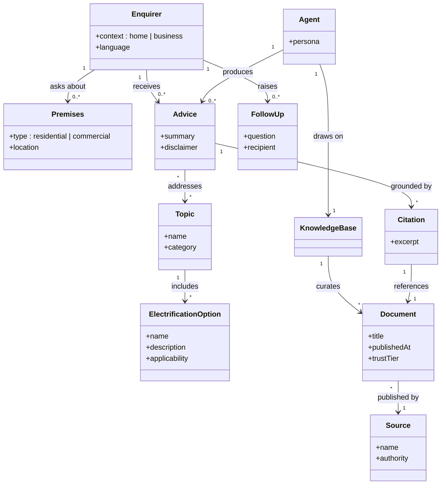

# Joulie — Project Scope

Conceptual scope for the Joulie sovereign AI electrification advisor. This document captures the **drivers and intentions** behind the project, the **Jobs To Be Done** that frame the requirements, and a **domain model** describing the key concepts and their relationships.

---

## 1. Drivers and Intentions

### Drivers (the "why")
- **Climate imperative.** Hutt City Council and the wider Aotearoa NZ community need to reduce emissions and accelerate the transition from fossil fuels to clean, renewable energy.
- **Advice gap.** There is a shortage of accessible, credible, conflict-of-interest-free electrification advice for homeowners and small businesses. Existing sources are often vendor-led, fragmented, or paywalled.
- **Trust deficit.** Consumers are wary of sales-driven information; an independent, community-grounded voice is needed.
- **Digital sovereignty.** Sensitive community conversations and curated NZ knowledge should not depend on offshore cloud providers.
- **Māori data sovereignty.** The project honours rangatiratanga, whakapapa, kotahitanga, manaakitanga, and kaitiakitanga — data and compute stay in Aotearoa and are stewarded according to tikanga.

### Intentions (the "what we will do")
- Build a **battery-powered, fully offline** AI advisor that can be taken to expos, market stalls, and community events, and embedded on a public website.
- Deliver advice through a **conversational voice and text** interface that speaks in a broad Kiwi register.
- Ground every response in a **curated, verifiable NZ knowledge base** via Retrieval Augmented Generation.
- Run entirely on **open-source models** on commodity Apple Silicon hardware (Mac Mini M4).
- Be transparent: every response carries an **informational-only disclaimer** and supports follow-up to a human team by email.
- Measure impact: capture qualitative and quantitative analytics (satisfaction, duration, response time, energy used) without compromising privacy.

### Non-goals
- Joulie is **not** a regulated financial, legal, or engineering advisor.
- Joulie does **not** transact, quote, or refer to specific commercial vendors.
- Joulie does **not** rely on cloud LLM APIs at runtime.

---

## 2. Jobs To Be Done

JTBD framed as: *When ___, I want to ___, so I can ___.*

### Primary JTBD — Community member at an expo
- **JTBD-01** When I am considering electrifying my home, I want to ask plain-language questions and hear trustworthy Kiwi-voiced answers, so I can make an informed next step without sales pressure.
- **JTBD-02** When I run a small business in the Hutt, I want to understand which commercial electrification options apply to my premises, so I can plan a transition that saves money and reduces emissions.
- **JTBD-03** When English is not my first language, I want the agent to respond in the language I spoke, so I can participate equally in the conversation.
- **JTBD-04** When I have a follow-up question Joulie cannot answer, I want to leave a spoken message for the human team, so I can continue the conversation later.
- **JTBD-05** When I finish my conversation, I want my context to be cleared, so the next visitor starts fresh and my interaction stays private.

### Operator JTBD — Electrify the Hutt volunteer
- **JTBD-06** When I set up at a venue, I want Joulie to run from battery without internet, so I can deploy anywhere without infrastructure.
- **JTBD-07** When I activate Joulie, I want a single physical action (e.g. picking up the handset or pressing a large push-to-talk button) to start and stop conversations, so the kiosk is approachable to first-time users without any keyboard.
- **JTBD-08** When a conversation ends, I want a summary, a satisfaction score, and timing metrics captured, so we can demonstrate impact and improve the service.
- **JTBD-09** When I display Joulie publicly, I want the disclaimer to be spoken at the start of each conversation and visible on the display, so users understand the informational nature of responses without needing to read.

### Curator JTBD — Knowledge base steward
- **JTBD-10** When new NZ electrification guidance is published by a trusted authority, I want to ingest it into the knowledge base, so Joulie's answers stay current and grounded.
- **JTBD-11** When I add a document, I want its provenance retained, so Joulie can cite sources and we can honour whakapapa of knowledge.

### Maintainer JTBD — Developer
- **JTBD-12** When I clone the repo, I want a reproducible Python environment and a single command to run Joulie, so I can iterate quickly.
- **JTBD-13** When models or pipelines change, I want tests and analytics to catch regressions in latency and answer quality, so the kiosk experience stays reliable.

---

## 3. Domain Model

The chat / voice interaction loop is taken as understood. This model focuses on the **electrification advisory domain** — the entities Joulie reasons about and stewards.

### Glossary
- **Enquirer** — A person seeking advice, in a home or business context.
- **Premises** — The home or commercial site the enquiry concerns.
- **Topic** — A subject area within electrification (e.g. heating, hot water, transport, solar, batteries).
- **ElectrificationOption** — A specific clean-energy choice within a Topic (e.g. heat pump, EV charger, rooftop PV).
- **Agent** — The Joulie persona that produces advice grounded in the knowledge base.
- **KnowledgeBase** — The curated corpus of trusted NZ electrification material.
- **Document** — A single piece of curated content with provenance and a trust tier.
- **Source** — The authoring authority behind a Document (regulator, research body, council, etc.).
- **Citation** — The link from a piece of Advice back to a Document excerpt.
- **Advice** — A grounded response to an enquiry, always carrying the informational-only disclaimer.
- **FollowUp** — A question handed off to the Electrify the Hutt team when it falls outside Joulie's scope.
